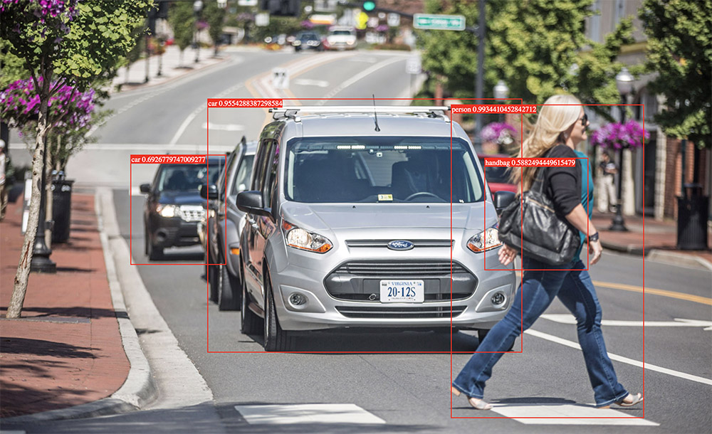

# tfjs-yolov3

### Introduction

A Tensorflow.js implementation of YOLOv3 and YOLOv3-tiny

Note: Must Tensorflow.js@v0.12.4+

# Features
- can recognize images of **any size**
- Support both **yolov3** and **yolov3-tiny**

## Quick Start

### Install

```
npm install tfjs-yolov3
```

### Usage Example

```javascript
import { yolov3, yolov3Tiny } from 'tfjs-yolov3'

async function start () {
  const yolo = await yolov3Tiny() // pre-load model (35M)
  // or
  // const yolo = await yolov3() // pre-load model (245M)

  const $img = document.getElementById('img')
  const boxes = await yolo({ $img }) 
  draw(boxes) // Some draw function
}
start()
```

## DEMO

[Check out the Live Demo](https://zqingr.github.io/tfjs-yolov3-demo/)  
  



## API Docs

TODO
